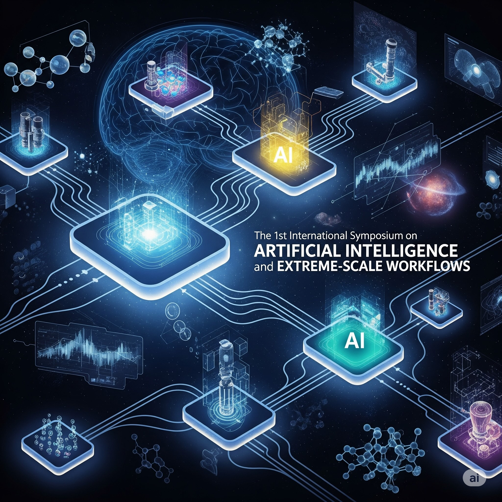

# [AIExScale 2025](https://sc25.conference-program.com/session/?sess=sess213)

# First International Symposium on Artificial Intelligence and Extreme-Scale Workflows

**Co-located with the [International Conference for High Performance Computing, Networking, Storage, and Analysis (SC'2025)](https://sc25.supercomputing.org) to be held in St-Louis, Missouri.**

**Date: November 21, 2025**

# Description {#description}

Extreme-scale workflows play a crucial role in increasing scientific productivity by helping scientists orchestrate today's scientific campaigns. With the recent developments in artificial intelligence (AI) and its growing application in scientific campaigns, we started to witness the integration of AI tasks into scientific workflows (workflows for AI). There can also be significant benefits for existing scientific workflows when augmenting them with AI (AI for workflows). Given the early stage of these emerging topics, more effort is needed to outline the role of AI in scientific workflows. The 1st International Symposium on Artificial Intelligence and Extreme-Scale Workflows will provide the scientific community with a dedicated platform for discussing current efforts, opportunities, and open challenges in AI and scientific workflows. This symposium features invited talks given by the leaders in the field and aims to further advance AI workflows by fostering new connections and ideas among the workshop participants.

**This symposium will actively drive discussion and will cover the following key topics:**	
- AI workflows: Highlighting opportunities of AI workflows for science.
- Integration challenges: Discussing challenges associated with integrating traditional HPC workflows and AI pipelines. 
- Current landscape: Presenting the ongoing efforts in the workflows community to develop and support AI workflows. 
- Emerging workflows: Highlighting novel use cases of AI workflows. 
- Large language models (LLMs): Examining the potential roles and applications of LLMs in the context of AI workflows. 
- Future directions: Engaging in a moderated discussion with the audience on the roadmap for AI workflows, addressing both technical and community-driven priorities. 

  

# Goals {#goals}

The main goal of this workshop is to review the current efforts of AI workflows and outline the opportunities and the open challenges in this field. We hope that the talks will foster new collaborations and new ideas among the workshop attendees. Furthermore, AI workflows encompass a broad range of communities such as HPC, AI, workflows, and domain scientists. Further developments in AI workflows depend on individuals from these groups working closely with each other, and building new connections between these communities is another goal of this workshop. A workshop report highlighting the activities, findings, and future directions for AI workflows will be published at arXiv and will be submitted to an international journal within this field.

## Program {#program}

### 8:30 AM - Welcome
<a href="/speakers/orcun-yildiz" class="speaker-name">Orcun Yildiz</a>, <a href="/speakers/loic-pottier" class="speaker-name">Loïc Pottier</a>

### 8:35 AM - 09:30 AM - <a href="/talks/keynote-tbd">Featured Speaker: Trillion-Parameter Foundation Models as Discovery Accelerators: Toward a Scientific Discovery Platform</a>
<a href="/speakers/ian-foster" class="speaker-name">Ian Foster</a>

### 09:30 AM - 10:00 AM - <a href="/talks/invited-talk-1">Invited Talk: How Complex AI Workflows Are Driving the Future of HPC Architectures?</a>
<a href="/speakers/debbie-bard" class="speaker-name">Debbie Bard</a>

### 10:00 AM - 10:30 AM - Break

### 10:30 AM - 11:00 AM - <a href="/talks/invited-talk-2">Invited Talk: AI-Ready Scientific Workflows at Scale: Bridging Data, Infrastructure, and Automation</a>
<a href="/speakers/rafael-ferreira-da-silva" class="speaker-name">Rafael Ferreira da Silva</a>

### 11:00 AM - 11:30 AM - <a href="/talks/invited-talk-3">Invited Talk: Intelligent Workflows at Scale: AI-Driven Exploration of Cosmological Simulations</a>
<a href="/speakers/katrin-heitmann" class="speaker-name">Katrin Heitmann</a>

### 11:30 AM - 12:20 PM - <a href="/talks/moderated-discussion">Moderated Discussion</a>

### 12:20 AM - Closing Remarks
<a href="/speakers/orcun-yildiz" class="speaker-name">Orcun Yildiz</a>, <a href="/speakers/loic-pottier" class="speaker-name">Loïc Pottier</a>

# Organization {#organization}

## Symposium Co-chairs
- Orcun Yildiz (Argonne National Laboratory, USA) oyildiz at anl.gov
- Loïc Pottier (Lawrence Livermore National Laboratory, USA) pottier1 at llnl.gov

---

