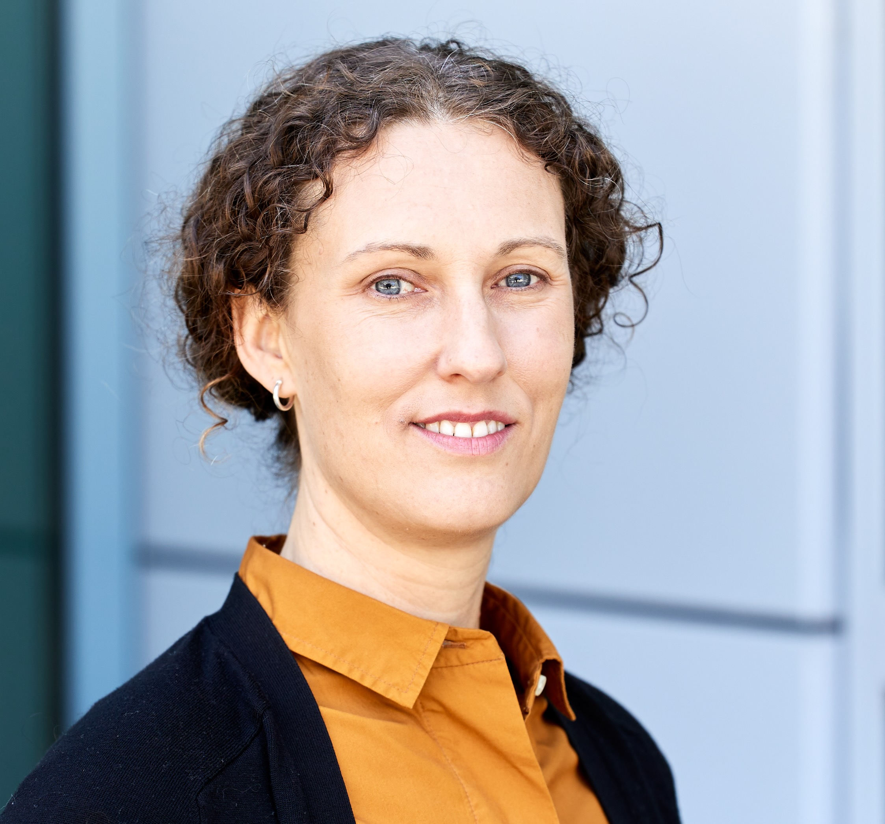

# Debbie Bard

  

    
  

  

    <h2>Biography</h2>
    
Dr. Debbie Bard is a physicist and data scientist with 20 years experience in scientific computing, working in particle physics, cosmology and HPC. She leads the Science Engagement and Workflows department at the National Energy Research Scientific Computing center (NERSC), responsible for delivering HPC, data and AI services for NERSC’s 11,000 users, including user support and engagement. She is particularly interested in multi-facility science and integrating experimental facilities with HPC. Debbie has led multiple complex cross-institutional projects, for example the Superfacility initiative at Lawrence Berkeley National Lab and the DOE’s Integrated Research infrastructure program.
  
    
    <h2>Contact</h2>
    <ul>
      <li>Institution: National Energy Research Scientific Computing Center (NERSC) </li>
      <li>Email: djbard at lbl.gov</li>
    </ul>
  

---

<a href="/" style="color: #4ade80; text-decoration: none;">← Back to Symposium</a> 
