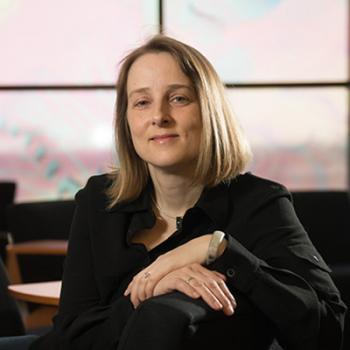

# Katrin Heitmann

  

    
  

  

    <h2>Biography</h2>
    
Dr. Katrin Heitmann is a cosmologist whose research involves large-scale computer simulations of the Universe, focused on understanding its distribution of matter and rate of expansion. She is a Deputy Division Director of High Energy Physics at the Argonne National Laboratory, the former spokesperson of the LSST Dark Energy Science Collaboration, a senior associate of the Kavli Institute for Cosmological Physics at the University of Chicago, an affiliate of the Northwestern-Argonne Institute of Science and Engineering at Northwestern University, and a senior member of the NSF-Simons SkAI Institute.

    
    <h2>Contact</h2>
    <ul>
      <li>Institution: Argonne National Laboratory </li>
      <li>Email: heitmann at anl.gov </li>
    </ul>
  

---

<a href="/" style="color: #4ade80; text-decoration: none;">← Back to Symposium</a> 