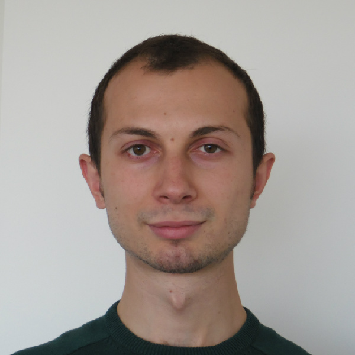

# Orcun Yildiz

  

    
  

  

    <h2>Biography</h2>
    
Orcun Yildiz is an assistant computer scientist with the Mathematics and Computer Science Division at Argonne National Laboratory. He received his Ph.D. degree in Computer Science from Ecole Normale Superieure de Rennes (France) in December 2017. His research interests include in situ workflows, HPC, Big Data, and AI convergence, and I/O management.

    
    <h2>Contact</h2>
    <ul>
      <li>Institution: Argonne National Laboratory</li>
      <li>Email: oyildiz at anl.gov</li>
    </ul>
  

---

<a href="/" style="color: #4ade80; text-decoration: none;">← Back to Symposium</a> 