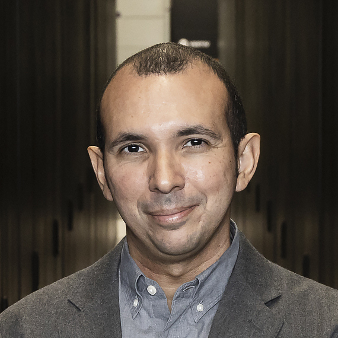

# Rafael Ferreira da Silva

  

    
  

  

    <h2>Biography</h2>
    
Dr. Rafael Ferreira da Silva leads the Workflow and Ecosystem Services group at Oak Ridge National Laboratory. He serves as a Senior Research Scientist in the National Center for Computational Sciences. His expertise lies at the intersection of advanced distributed systems and scientific innovation, specializing in parallel and distributed computing with expertise spanning scientific workflows, hybrid quantum classical systems, and autonomous science. Dr. Ferreira da Silva is the Special Content Editor for Future Generation Computer Systems journal and holds senior memberships in IEEE and ACM. As Founder and Executive Director of the Workflows Community Initiative, he brings researchers together to advance workflow management and applications.

    
    <h2>Contact</h2>
    <ul>
      <li>Institution: Oak Ridge National Laboratory</li>
      <li>Email: silvarf at ornl.gov</li>
    </ul>
  

---

<a href="/" style="color: #4ade80; text-decoration: none;">← Back to Symposium</a> 